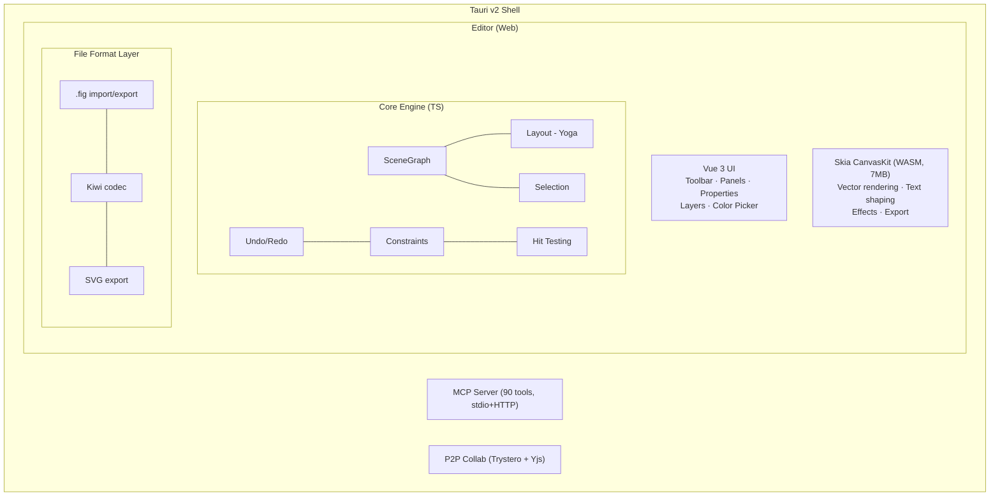

# Architecture

## System Overview

## Editor Layout

The UI follows Figma's UI3 layout — toolbar at the bottom, navigation on the left, properties on the right:

- **Navigation panel (left)** — Layers tree, pages panel
- **Canvas (center)** — Infinite canvas with CanvasKit rendering, zoom/pan
- **Properties panel (right)** — Context-sensitive sections: Appearance, Fill, Stroke, Typography, Layout, Position
- **Toolbar (bottom)** — Tool selection: Select, Frame, Section, Rectangle, Ellipse, Line, Text, Pen, Hand

## Components

### Rendering (CanvasKit WASM)

The same rendering engine as Figma. CanvasKit provides GPU-accelerated 2D drawing with vector shapes, text shaping via Paragraph API, effects (shadows, blurs, blend modes), and export (PNG, SVG). The 7MB WASM binary loads at startup and creates a GPU surface on the HTML canvas.

The renderer is split into focused modules in `packages/core/src/renderer/`: scene traversal, overlays, fills, strokes, shapes, effects, rulers, labels, and remote cursors.

### Scene Graph

Flat `Map<string, Node>` keyed by GUID strings. Tree structure via `parentIndex` references. Provides O(1) lookup, efficient traversal, hit testing, and rectangular area queries for marquee selection.

The graph emits typed events via nanoevents: `node:created`, `node:updated`, `node:deleted`, `node:reparented`, `node:reordered`. Subsystems subscribe to these instead of manual call-site wiring — the editor uses them for render invalidation and microtask-batched component instance sync, while the collab system uses them for Yjs propagation.

See [Scene Graph Reference](/reference/scene-graph) for internals.

### Layout Engine (Yoga WASM)

Meta's Yoga provides CSS flexbox and grid layout computation via a [fork](https://github.com/open-pencil/yoga/tree/grid) with CSS Grid support. A thin adapter maps Figma property names to Yoga equivalents:

| Figma Property | Yoga Equivalent |
|---|---|
| `stackMode: HORIZONTAL` | `flexDirection: row` |
| `stackMode: VERTICAL` | `flexDirection: column` |
| `stackSpacing` | `gap` |
| `stackPadding` | `padding` |
| `stackJustify` | `justifyContent` |
| `stackChildPrimaryGrow` | `flexGrow` |

### File Format (Kiwi Binary)

Reuses Figma's Kiwi binary codec with 194 message/enum/struct definitions. Import: parse header → Zstd decompress → Kiwi decode → `NodeChange`[] → scene graph. Export reverses the process with thumbnail generation.

See [File Format Reference](/reference/file-format) for details.

### AI & Tools

Tools are defined once in `packages/core/src/tools/`, split by domain: read, create, modify, structure, variables, vector, analyze. Each tool has typed params and an `execute(figma, args)` function. Adapters convert them for:

- **AI chat** — valibot schemas, multi-provider (Anthropic, OpenAI, Google AI, OpenRouter, compatible endpoints)
- **MCP server** — zod schemas, stdio + HTTP transports
- **CLI** — available via the `eval` command

90+ core tools + 3 MCP file management tools. Includes XPath query (`query_nodes`), JSX inspection (`get_jsx`, `diff_jsx`), semantic description (`describe`), and vision-based verification (`export_image` returns images to the model).

### Undo/Redo

Inverse-command pattern. Before applying any change, affected fields are snapshotted. The snapshot becomes the inverse operation. Batching groups rapid changes (like drag) into single undo entries.

### Clipboard

Figma-compatible bidirectional clipboard. Encodes/decodes Kiwi binary (same format as .fig files) via native browser copy/paste events. Handles vector path scaling, instance children, component set detection, and override application.

### P2P Collaboration

Real-time peer-to-peer collaboration via Trystero (WebRTC) + Yjs CRDT. No server relay — signaling over MQTT public brokers, STUN/TURN for NAT traversal. Awareness protocol provides live cursors, selections, and presence. Local persistence via y-indexeddb.

### CLI-to-App RPC Bridge

When the desktop app is running, CLI commands connect to it via WebSocket instead of requiring a .fig file. The automation server runs on `127.0.0.1:7600` (HTTP) and `127.0.0.1:7601` (WebSocket). Commands execute against the live editor state, enabling automation scripts and AI agents to interact with the running app.

## What's Next

### Full figma-use Tool Set

The MCP server currently exposes 90 tools. The reference implementation in [figma-use](https://github.com/dannote/figma-use) has 118. The remaining tools cover advanced layout constraints, prototype connections, advanced component property editing, and bulk document operations.

### CI Design Tooling

The headless CLI already supports `analyze colors/typography/spacing/clusters`. Next: GitHub Actions integration for automated design linting and visual regression in PRs.

### Prototyping

Frame-to-frame transitions, interaction triggers (click, hover, drag), overlay management, and fullscreen preview mode.

### Windows Code Signing

macOS binaries are signed and notarized since v0.6.0. Windows Authenticode signing via Azure Code Signing is planned to remove the SmartScreen warning.
